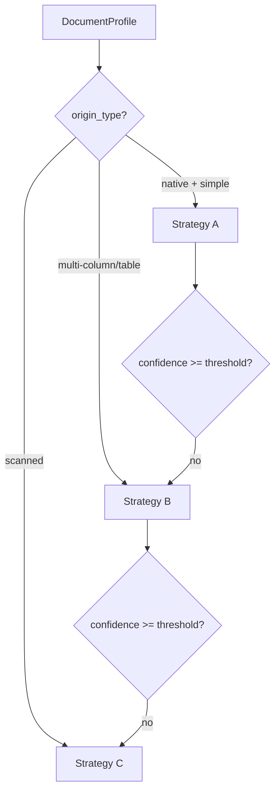
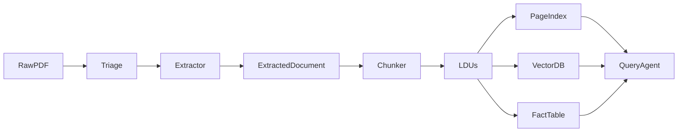
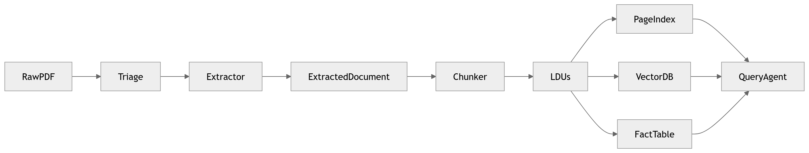

# ARCHITECTURE.md

## Document Intelligence Refinery — System Architecture

### Project Overview

The Document Intelligence Refinery is a multi-stage, agentic pipeline that converts heterogeneous enterprise documents into structured, queryable, and spatially-indexed knowledge. It combines fast text extraction, layout-aware parsing, and vision-augmented models with confidence-gated escalation to balance cost and fidelity. Every extracted fact carries provenance so answers can be verified directly against the source document.

---

# 1. Design Principles

This architecture follows Forward Deployed Engineer (FDE) principles:

### 1.1 Spec-Driven

Schemas defined first (Pydantic) → implementations follow.

### 1.2 Strategy-Based Extraction

Multiple specialized extractors outperform a single “universal OCR”.

### 1.3 Confidence-Gated Escalation

Never pass low-quality text downstream.

### 1.4 Spatial Provenance by Default

Every fact must map to:

* page number
* bounding box
* content hash

### 1.5 Cost-Aware Intelligence

Prefer cheap strategies first, escalate only when necessary.

---

# 2. High-Level Pipeline

---

# 3. Five-Stage Architecture

---

## Stage 1 — Triage Agent (Document Classifier)

### Responsibility

Characterize document before extraction.

### Inputs

* Raw document (PDF/image/etc.)

### Outputs

* `DocumentProfile`

### Signals Collected

* Character density
* Image coverage ratio
* Layout complexity
* Language detection
* Domain hints (keywords)

### Decisions Produced

* origin_type
* layout_complexity
* estimated_extraction_cost
* recommended strategy tier

### Why First?

Extraction strategy depends on document type. Misclassification causes cascading failures.

---

## Stage 2 — Structure Extraction Layer (Multi-Strategy)

### Responsibility

Extract text + structure with best fidelity at lowest cost.

### Strategy Pattern

| Strategy         | Cost   | Trigger                        | Tooling              |
| ---------------- | ------ | ------------------------------ | -------------------- |
| A — Fast Text    | Low    | Native digital + simple layout | pdfplumber / pymupdf |
| B — Layout-Aware | Medium | Multi-column / table-heavy     | Docling or MinerU    |
| C — Vision       | High   | Scanned or low confidence      | VLM (GPT-4o/Gemini)  |

---

### Routing Logic

### Escalation Guard

If confidence < threshold → automatically retry higher tier.

### Ledger

Every extraction logged:

* strategy_used
* confidence_score
* processing_time
* estimated_cost

---

## Stage 3 — Semantic Chunking Engine

### Responsibility

Transform raw extraction into Logical Document Units (LDUs).

### Why?

Token-based chunking breaks:

* tables
* captions
* clauses

### Rules (“Chunk Constitution”)

* Table cells never split from headers
* Captions attached to figures
* Lists remain intact
* Section metadata propagated
* Cross-references linked

### Output

`List[LDU]`

Each LDU contains:

* content
* bounding_box
* page_refs
* token_count
* parent_section
* content_hash

### Inspiration

Semantic boundaries similar to Chunkr.

---

## Stage 4 — PageIndex Builder

### Responsibility

Create navigable section hierarchy.

### Why?

Avoid searching entire 400-page document for each query.

### Structure

Tree:

* title
* page_start/end
* children
* summary
* entities
* data_types_present

### Benefits

* Faster retrieval
* Higher precision
* Lower embedding cost

### Inspiration

PageIndex.

---

## Stage 5 — Query Interface Agent

### Responsibility

Answer questions with verifiable citations.

### Implementation

LangGraph agent with three tools:

* pageindex_navigate
* semantic_search
* structured_query (SQLite)

### Mandatory Behavior

Every answer must include:

`ProvenanceChain`

* document_name
* page_number
* bbox
* content_hash

### Modes

* Q&A
* Structured numeric queries
* Audit mode (claim verification)

---

# 4. Data Flow Diagram

---

# 5. Core Schemas

All stages communicate via typed Pydantic models:

* DocumentProfile
* ExtractedDocument
* LDU
* PageIndexNode
* ProvenanceChain

This ensures:

* deterministic contracts
* testability
* stage isolation

---

# 6. Cost Strategy

| Tier      | Relative Cost | When Used         |
| --------- | ------------- | ----------------- |
| Fast Text | 1x            | default           |
| Layout    | 3–5x          | complex structure |
| Vision    | 10–20x        | scanned/failed    |

Principle:

> escalate only when confidence is low

---

# 7. Failure Mode Mitigation Map

| Failure               | Mitigation              |
| --------------------- | ----------------------- |
| Structure collapse    | Layout-aware extraction |
| OCR noise             | Vision fallback         |
| Hallucinations        | Provenance citations    |
| Slow retrieval        | PageIndex navigation    |
| Chunk boundary errors | Semantic chunking rules |

---

# 8. Why This Architecture Works

### Reliability

Confidence gating prevents garbage-in downstream hallucinations.

### Scalability

Each stage independently replaceable or parallelizable.

### Cost Control

Vision models only used when necessary.

### Auditability

Every answer traceable to page + bbox.

### FDE Readiness

New domains handled by config changes (rules.yaml), not code.

---

