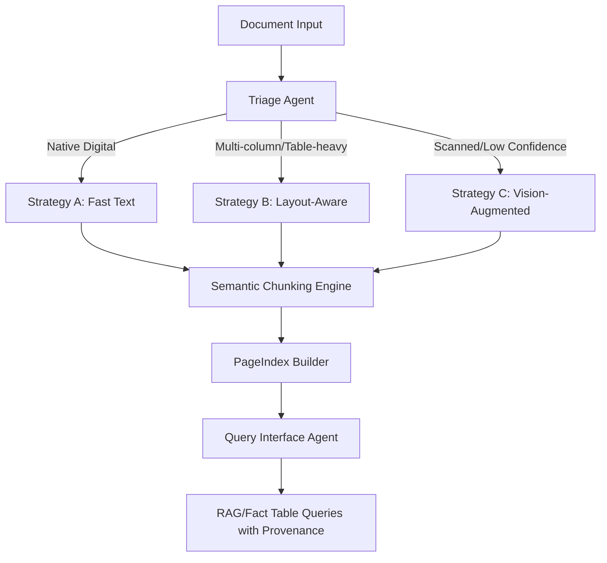

---

# DOMAIN_NOTES.md

## Document Intelligence Refinery

The Document Intelligence Refinery is a multi-stage, agentic pipeline designed to transform heterogeneous enterprise documents (PDFs, scans, spreadsheets, and slide decks) into structured, queryable, spatially-indexed knowledge. It ensures high extraction fidelity by combining fast text, layout-aware, and vision-augmented strategies, while preserving logical document units and full provenance. The system enables enterprises to rapidly unlock the value of their document repositories for reliable retrieval, analysis, and audit.

---

## 1. Extraction Strategy Decision Tree

The goal is to decide **which extraction strategy to use** for a given document based on its type and layout.

```
                 +--------------------+
                 |   Document Input   |
                 +--------------------+
                           |
                           v
                   [Triage Agent]
       Detect: origin_type | layout_complexity | domain_hint | language
                           |
       --------------------------------------------------------
       |                       |                               |
Native Digital          Scanned/Image                 Mixed / Complex
(single column)        (no text stream)         (multi-column, tables)
       |                       |                               |
       v                       v                               v
[Strategy A]            [Strategy C]                  [Strategy B]
Fast Text Extractor     Vision-Augmented           Layout-Aware Extractor
(pdfplumber / pymupdf)  (VLM: GPT-4o, Gemini)      (MinerU / Docling)
       |                       |                               |
Confidence Check → Escalate if Low  --------------------------
```

**Notes:**

* **Strategy A (Fast Text)**: Low-cost, digital PDFs with high character density.
* **Strategy B (Layout-Aware)**: Medium-cost, multi-column or table-heavy documents.
* **Strategy C (Vision-Augmented)**: High-cost, scanned documents or low-confidence pages.

**Escalation Guard:** Any low-confidence extraction automatically escalates to the next strategy to prevent hallucinations in downstream RAG.

---

## 2. Failure Modes Observed Across Document Types

| Failure Mode                    | Document Class              | Observations                                                                | Mitigation Idea                                                   |
| ------------------------------- | --------------------------- | --------------------------------------------------------------------------- | ----------------------------------------------------------------- |
| Structure Collapse              | All Classes                 | Tables split incorrectly, multi-column layouts flattened                    | Use layout-aware extraction or vision-based OCR for complex pages |
| Context Poverty                 | All Classes                 | Chunking naively by tokens breaks logical units (tables, captions, clauses) | Implement semantic chunking respecting LDUs                       |
| Provenance Blindness            | All Classes                 | Cannot trace data back to page or bounding box                              | Store bounding boxes and page refs with content_hash for each LDU |
| OCR Noise                       | Scanned Docs                | Handwriting or faint scans misread by naive OCR                             | Vision-augmented extraction with confidence threshold             |
| Numeric Precision Loss          | Financial/Structured tables | Floating point misreads, commas vs periods                                  | Table-aware extraction, cross-verify with headers                 |
| Reading Order Misinterpretation | Multi-column                | Columns read in wrong sequence                                              | MinerU / Docling layout parsing to reconstruct order              |
| Figure/Caption Separation       | Technical Reports           | Figures separated from captions                                             | Capture as a combined LDU with metadata                           |
| Cross-reference Breakage        | Legal / Financial           | References to tables/figures lost in chunking                               | Store parent_section and cross-reference links in LDU             |

---

## 3. Core Tool Insights

| Tool                                                | Purpose                             | Key Insight                                                                                                                                    |
| --------------------------------------------------- | ----------------------------------- | ---------------------------------------------------------------------------------------------------------------------------------------------- |
| [MinerU](https://github.com/opendatalab/MinerU)     | Layout-aware PDF extraction         | Multi-model pipeline: PDF Extract Kit → Layout Detection → Formula/Table Recognition → Markdown export. Specialized models for each structure. |
| [Docling](https://github.com/DS4SD/docling)         | Enterprise document understanding   | Unified DoclingDocument representation; captures text, tables, figures in one traversable object. Ideal for standardizing output.              |
| [PageIndex](https://github.com/VectifyAI/PageIndex) | Hierarchical navigation / smart TOC | Section-level indexing; allows RAG to locate relevant chunks without scanning entire document.                                                 |
| [Chunkr](https://github.com/lumina-ai-inc/chunkr)   | RAG-optimized chunking              | Chunk boundaries respect semantic units (paragraphs, table cells, captions) rather than token counts → improves retrieval precision.           |
| [Marker](https://github.com/VikParuchuri/marker)    | PDF → Markdown                      | Handles multi-column layouts, equations, and figures better than naive OCR; good reference for layout handling.                                |

---

## 4. Pipeline Diagram (Mermaid)



**Legend:**

* **Triage Agent:** Classifies document type, layout, language, domain.
* **Strategies A/B/C:** Confidence-gated extractors.
* **Chunking Engine:** Converts extraction into LDUs.
* **PageIndex:** Builds navigable hierarchical structure.
* **Query Agent:** Provides structured query interface with full provenance.

---

## 5. Key Takeaways

1. **Vision vs OCR:**

   * For multi-column financial tables or scanned reports, vision models outperform traditional OCR in **structure fidelity** and **numeric precision**.
   * Cost tradeoff: only escalate low-confidence pages to VisionExtractor.

2. **Semantic Chunking:**

   * Token-based chunking is insufficient; must preserve logical document units (LDUs).

3. **Provenance is Mandatory:**

   * Every extracted fact should carry `page_number`, `bounding_box`, and `content_hash`.

4. **Decision Tree Rules:**

   * Native + single column → Strategy A
   * Complex/multi-column → Strategy B
   * Scanned or low-confidence → Strategy C

---

